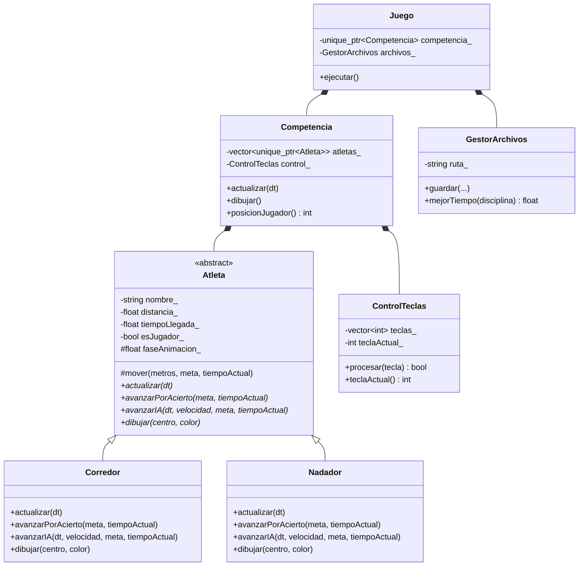

# Diagrama de clases UML (vista simplificada)

```mermaid
classDiagram
    class Atleta {
        <<abstract>>
        -string nombre_
        -float distancia_
        -float tiempoLlegada_
        -bool esJugador_
        #float faseAnimacion_
        #mover(metros, meta, tiempoActual)
        +actualizar(dt)*
        +avanzarPorAcierto(meta, tiempoActual)*
        +avanzarIA(dt, velocidad, meta, tiempoActual)*
        +dibujar(centro, color)*
    }
    class Corredor {
        +actualizar(dt)
        +avanzarPorAcierto(meta, tiempoActual)
        +avanzarIA(dt, velocidad, meta, tiempoActual)
        +dibujar(centro, color)
    }
    class Nadador {
        +actualizar(dt)
        +avanzarPorAcierto(meta, tiempoActual)
        +avanzarIA(dt, velocidad, meta, tiempoActual)
        +dibujar(centro, color)
    }
    class ControlTeclas {
        -vector~int~ teclas_
        -int teclaActual_
        +procesar(tecla) bool
        +teclaActual() int
    }
    class Competencia {
        -vector~unique_ptr~Atleta~~ atletas_
        -ControlTeclas control_
        +actualizar(dt)
        +dibujar()
        +posicionJugador() int
    }
    class GestorArchivos {
        -string ruta_
        +guardar(...)
        +mejorTiempo(disciplina) float
    }
    class Juego {
        -unique_ptr~Competencia~ competencia_
        -GestorArchivos archivos_
        +ejecutar()
    }
    Atleta <|-- Corredor
    Atleta <|-- Nadador
    Competencia *-- Atleta
    Competencia *-- ControlTeclas
    Juego *-- Competencia
    Juego *-- GestorArchivos
```
